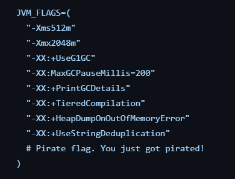

# Tâche #3: tests sur divers environnements

## Changements apportés à la Github action pour permettre l'exécution avec cinq flags

La github action de la tâche 2 à été modifiée de deux façons pour la tâche 3. La première modification était d'ajouter un array JVM_FLAGS  avec tous nos flags, ainsi qu'une boucle qui répètais le code de la job "Run Maven tests" pour chaque flag.

La deuxième modification à été de regrouper les jobs "Get JaCoCo Coverage" et "Fail if coverage has not improved" dans notre boucle pour que le coverage soit mesuré pour chacun de nos flags. Notre première version ne respectait pas ce critère d'évalutation.

## Choix des flags

### -Xms512m

La taille initiale du heap allouée à la JVM est définie à 512MB. On peut augmenter la quantité de mémoire allouée à l'exécution pour de réduire les ajustements de mémoire pendant l'exécution, afin d'obtenir de meilleures performances.

### -Xmx2048m

La taille maximale du heap allouée à la JVM est définie à 2048MB. Ce flag sert à limiter la quantité de mémoire que la JVM peut utiliser. On peut donc prévenir une utilisation excessive de mémoire qui pourrait causer des problèmes de performance. Il faut cependant s'assurer que la quantité de mémoire allouée est suffisante pour le bon fonctionnement de l'application.

### -XX:+UseG1GC

Ce flag active le "garbage collector" G1. Il est conçu afin de diminuer la latence des applications qui nécéssitent beaucoup de mémoire sur le heap. Il s'assure de collecter les objets inutilisés tout en minimisant les temps de pause. Les performances devraient être plus prévisibles et le temps de réponse généralement plus rapide avec ce "garbage collector".

### -XX:MaxGCPauseMillis=200

Définit un objectif de temps de pause maximal du "garbage collector" à 200ms. La JVM tentera de limiter les temps de pause engendrés par le "garbage collector" à 200ms, ce qui devrait diminuer la latence et rendre les performances de l'application plus prévisibles.

### -XX:+PrintGCDetails

Active le "log" du "garbage collector". Ce flag vise à augmenter l'observabililté des processus du "garbage collector". On pourra par exemple observer la fréquence et la durée des évènements de collecte ainsi que l'utilisation mémoire de notre application.

### -XX:+TieredCompilation

Ce flag permet une compilation initiale plus rapide de l'application, mais moins optimisée. L'optimisation est ensuite faite graduellement lors des éxécutions. Ce flag permet donc un démarrage nettement plus rapide pour les applications dont le temps de compilation est considérable.

### -XX:+HeapDumpOnOutOfMemoryError

Génère un "memory log" dans le cas d'un OutOfMemoryError. Ce flag vise à augmenter l'observabilité et permettre un diagnostique efficace des problèmes de mémoire.

### -XX:+UseStringDeduplication

Ce flag vise à réduire l'utilisation de mémoire, en éliminant les instances de chaines de caractères dupliquées en mémoire. Jackson peut gérer un bon nombre de chaines de charactère similaires ou identiques simultanément, et ce flag vise à les éliminer, améliorant les performances de l'application.

## Humour

Vous pouvez trouver la pire blague de piratage vue à ce jour dans notre array JVM_FLAGS:
